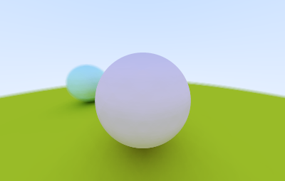
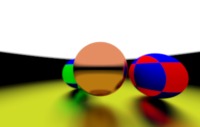
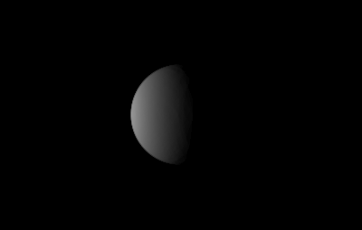
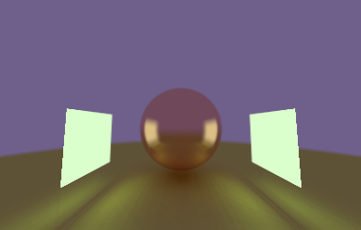
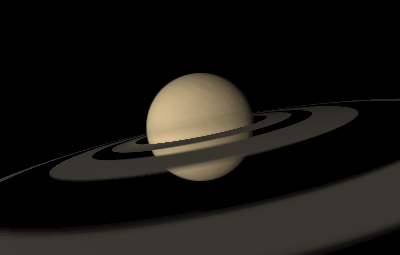
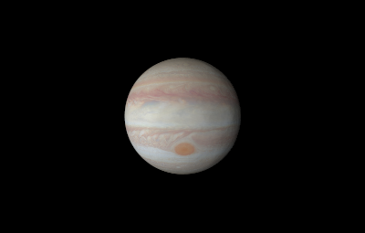
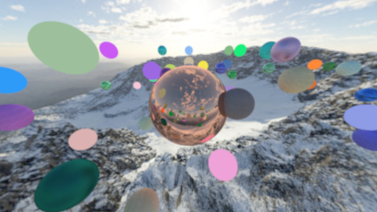
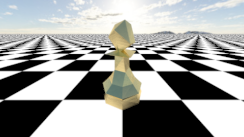

# Lime

<div align="center">


</div>

Lime is a render engine written in haskell that employs recursive eye-based ray tracing.
The recursive nature of the algorithm makes it ideal to implement in a purely functional language like haskell.

## Usage

Use `cabal` to build and run the project by running the following command

```ps1
$ cabal run Lime -- [-i|--input=PATH] [-o|--output=PATH] [-p|--preview=BOOL] [-t|--textures=DIR] [-m|--models=DIR]
```

Run `cabal run Lime -- --help` for more help

For reference scenes see [examples](Examples/Scenes/)

## Features

See [TODO](TODO.md)

### Animating / Scripting

Lime supports scripting through lua to procedurally generate scenes.
For a static scene, the script should expose the global variable `scene` see
[example](Examples/Scenes/Spheres.lua).
For an animation, the script should expose the global variable `scenes` which is
a list of all frames to be rendered see [example](<Examples/Scenes/Circling camera.anim.lua>).

Running ffmpeg with the following arguments stitches the frames.

```ps1
$ ffmpeg -framerate some_fps -i "some_dir\%d.png" some_video.mp4
```

## Documentation

Run `cabal haddock` in the project directory to build the library documentation

## Example Renders

<div align="center">

 

 

 

 


</div>
