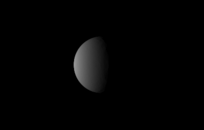
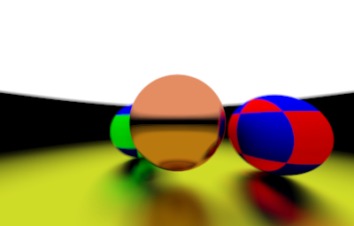

# Lime

<div align="center">


</div>

Lime is a render engine written in haskell that employs recursive eye-based ray tracing.
The recursive nature of the algorithm makes it ideal to implement in a purely functional language like haskell.

## Usage

### With nix

The [nix expression](shell.nix) provides support for nix. Just run the following command to build

```sh
$ nix-shell --command build
```

### Without nix

Use `cabal` to build and run the project by running the following command

```ps1
$ cabal run Lime -- [-i|--input=PATH] [-o|--output=PATH] [-f|--force=BOOL]
```

Run `cabal run Lime -- --help` for more help

For reference scenes see [examples](Examples)

## Features

See [TODO](TODO.md)

### Animating

With a small shell command Lime can be made to animate.
For example see [script](Scripts/Stitch.ps1).
You can vary any parameter in the same way.
Running ffmpeg with the following arguments generates the video.

```ps1
$ ffmpeg -framerate some_fps -i "some_dir\%d.png" some_video.mp4
```

See [example](#example-renders)

## Documentation

Run `cabal haddock` in the project directory to build the documentation

## Example Renders

<div align="center">

 

 

</div>
